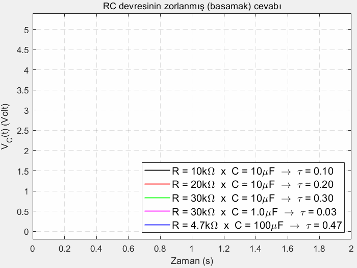
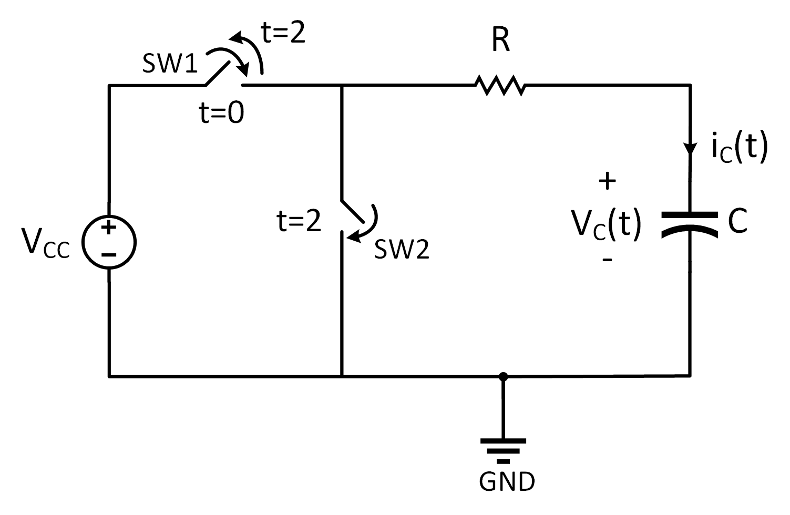
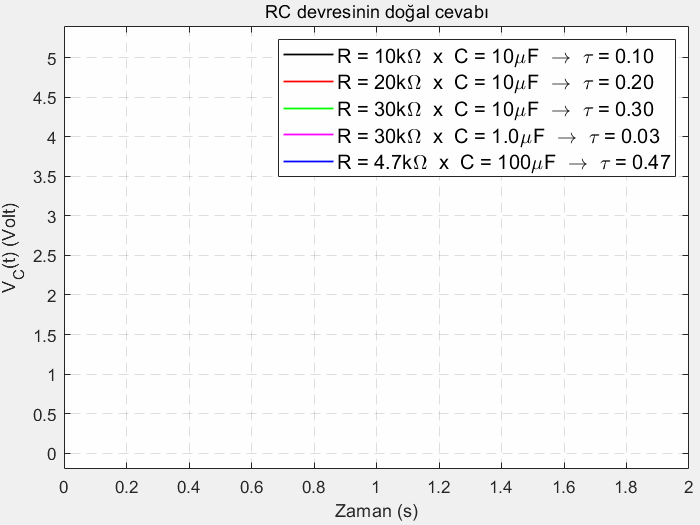
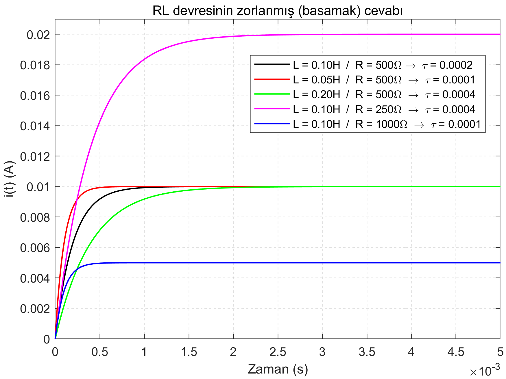

<h2>RLC Devreleri</h2>
<p align="justify">Bu sayfada kapasitör ve endüktör devre elemanlarının matematiksel modellerini ve Kirchoff'un akım ve gerilim kanunlarını kullanarak RC, RL ve RLC devrelerinin zorlanmış (basamak) ve doğal cevaplarına bakacağız.</p>
<h3>Kapasitörün Matematiksel Modeli</h3>
<p align="justify">Kapasitörün matematiksel modeli</p> 

$$i_C(t) = C\frac{dV_c(t)}{dt}$$

<p align="justify">olarak verilmişti. Bu birinci dereceden âdi diferansiyel denklemin her iki tarafının $k=t_0$ anından $k=t$ anına kadar integralini alırsak aşağıdaki çözümü elde ederiz.</p>

```math
V_C(t) = V_C(t_0) + \frac{1}{C}\int_{t_0}^ti_C(k)dk
```

<p align="justify">Önceden zamanı temsil eden yatay eksen için $t$ değişkenini kullanmamıza rağmen burada $t$ artık belirli bir anı temsil ettiğinden dolayı yatay eksene $k$ dedik. Bu $k$ değişkeni kukla değişken (İng. dummy variable) olarak bilinir.</p>
<hr>
<h3>RC Devresinin Zorlanmış Cevabı</h3>
<p align="justify">Aşağıdaki şekilde gördüğümüz güç kaynağı, rezistör ve kapasitörden oluşan RC devresinin zorlanmış cevabını analiz edelim. Burada güç kaynağını bağlayıp devre elemanları üzerinde gerilim-akım oluşturduğumuzdan dolayı devreyi "zorlamış" olduk.</p>

<figure>

<figcaption>RC devresi (zorlanmış cevap)</figcaption>
</figure>

<p align="justify">Yukarıdaki devrede ok yönünde dolaşıp Kirchoff'un Gerilimler Yasasını (İng. Kirchoff's Voltage Law - KVL) uygularsak aşağıdaki eşitliği elde ederiz.</p>

$$-V_{cc} + Ri(t) + V_C(t) = 0$$

<p align="justify">Devrede kapasitörün üzerinden geçen akım $i_C(t)$, aynı yönde tanımlandıklarından dolayı devrede dolaşan akım $i(t)$'ye eşit.</p>

$$i_C(t)=i(t)$$

<p align="justify">Bunu kullanarak kapasitörün matematiksel modelini KVL ile elde edilen denklemde yerine koyacak olursak</p>

$$-V_{cc} + RC\frac{dV_C(t)}{dt} + V_C(t) = 0$$

<p align="justify">birinci dereceden âdi diferansiyel denklemini elde ederiz. Bu denklemi düzenlersek</p>

$$\frac{dV_C(t)}{dt} = -\frac{1}{RC}V_C(t) + \frac{V_{cc}}{RC}$$

<p align="justify">hâline gelir.
<h4>Kalkülüs ile Çözüm</h4>
Biraz daha manipüle edersek</p>

$$\frac{dV_C(t)}{V_C(t)-V_{cc}} = -\frac{1}{RC}dt$$

<p align="justify">denklemini elde ederiz. Eşitliğin her iki tarafının integralini $k=t_0$'dan $k=t$ anına kadar alalım.</p>

$$\int_{k=t_0}^{k=t}\frac{dV_C(k)}{V_C(k)-V_{cc}}dk = -\frac{1}{RC}\int_{k=t_0}^{k=t}dk$$

<p align="justify">Dikkat edilirse soldaki ifade doğal logaritma ile alakalı bir integral. İntegralleri alarak ilerleyecek olursak</p>

$$ln(V_C(k)- V_{cc})\Big|_{k=t_0}^{k=t} = -\frac{1}{RC}k\Bigg|_{k=t_0}^{k=t}$$

$$\ln(V_C(t)- V_{cc}) - \ln(V_C(t_0)- V_{cc}) = -\frac{1}{RC}(t-t_0)$$

<p align="justify">soldaki doğal logaritma içeren ifadelerle yapılan çıkarma işlemi, aşağıdaki hâlini alırken</p>

$$\ln\Bigg(\frac{V_C(t)- V_{cc}}{V_C(t_0)- V_{cc}}\Bigg) = -\frac{t-t_0}{RC}$$

<p align="align">her iki tarafı $e \approx 2.71$'in üssü olarak yazarsak (birşey değişmeyeği gibi sol taraftaki doğal logaritma $\ln$ ifadesinden kurtulmuş olacağız)</p>

$$\frac{V_C(t)- V_{cc}}{V_C(t_0)- V_{cc}} = e^{\displaystyle -\frac{t-t_0}{RC}}
$$

<p align="justify">en sonunda aşağıdaki çözümü elde ederiz.</p>

$$V_C(t) = V_{cc} + V_C(t_0)e^{\displaystyle-\frac{t-t_0}{RC}} - V_{cc}e^{\textstyle-\frac{t-t_0}{RC}}$$

<p align="justify">Genelde $t_0 = 0$ olarak kabul ettiğimizden elde ettiğimiz çözüm aşağıdaki hâle gelir.</p>

$$V_C(t) = V_{cc} + V_C(0)e^{\displaystyle-\frac{t}{RC}} - V_{cc}e^{\displaystyle-\frac{t}{RC}}$$
<h4>Laplace Dönüşümü ile Çözüm</h4>
<p align="justify">Yukarıda devreye KVL uygulayıp biraz düzenleme yaptıktan sonra aşağıdaki âdi diferansiyel denklemi elde etmiştik.</p>

$$\frac{dV_C(t)}{dt} = -\frac{1}{RC}V_C(t) + \frac{V_{cc}}{RC}$$

<p align="justify">Kalkülüs bilgilerimizi kullanarak integraller çözerek elde ettiğimiz çözümü şimdi de Laplace Dönüşümü kullanarak elde edelim. Yukarıda diferansiyel denklem zamanla değişmeyen doğrusal bir sistemi (İng. linear time-invariant - LTI) matematiksel olarak tasvir ettiğinden dolayı Laplace uygulamak çözümü elde etmek için en kolay yoldur. Hatırlamak gerekirse, Laplace dönüşümü zamanda tanımlı bir fonksiyonu s alanı (İng. s domain) dediğimiz (aynı zamanda frekans alanı da denen) bölgeye eşleştiriyor (İng. mapping). Zamanda $f(t)$ ile gösterilen bir fonksiyonun Laplace dönüşümü</p>

$$F(s) = L\big[f(t)\big] = \int_{-\infty}^{-\infty}f(t)e^{-st} dt$$

<p align="justify">olarak tanımlanmakta. Burada devreyi $t=0$ anında incelemeye başladığımızı kabul edersek, yukarıdaki integral aşağıdaki hâle gelir.</p>

$$F(s) = \int_{0}^{-\infty}f(t)e^{-st}dt$$

<p align="justify">Şimdi bu dönüşümü yukarıda devreyi betimleyen diferansiyel denklemin her iki yanına uygularsak</p>

$$L\Bigg[\frac{dV_C(t)}{dt}\Bigg] = -\frac{1}{RC}L\big[V_C(t)\big] + \frac{V_{cc}}{RC}L\big[1\big]$$

<p align="justify">ifadesini elde ederiz. Tabi burada $V_{cc}$ terimini DC voltaj kaynağı varsaydığımızdan zamanla değişmeyen bir sabit kabul ettik. Yoksa voltaj kaynağı zamanla değişen bir sinyal olması durumunda Laplace operatörünün dışına direk çıkamazdı. Devam edecek olursak, Laplace tablosundan faydalanarak aşağıdaki dönüşümleri gerçekleştirelim.</p>

$$sV_C(s)-V_C(0) = -\frac{1}{RC}V_C(s) + \frac{V_{cc}}{RCs}$$

<p align="justify">Düzenleyerek devam edecek olursak</p>

$$\Bigg(s+\frac{1}{RC}\Bigg)V_C(s) = V_C(0) + \frac{V_{cc}}{RCs}$$

<p align="justify">elde edilir. Daha da düzenlersek</p>

$$V_C(s) = \frac{V_{cc}}{s} + \frac{V_C(0)}{s+\frac{1}{RC}} - \frac{V_{cc}}{s+\frac{1}{RC}}$$

<p align="justify">elde edilir. Burada ters Laplace dönüşümü uygularsak, yukarıda Kalkülüs kullanarak integraller aracılığıyla elde edilen çözümün aynısına ulaşmış oluruz.</p>

$$V_C(t) = V_{cc} + V_C(0)e^{\displaystyle-\frac{t}{RC}} - V_{cc}e^{\displaystyle-\frac{t}{RC}}$$

<h4>Çözümün Yorumlanması ve Grafiği</h4>
<p align="justify">Aşağıda grafiğini çizdireceğimiz bu fonksiyon hakkında uç değerlere bakarak düşünecek olursak $t = 0$ iken $V_C(0) = V_C(0)$ ve</p>

$$\lim_{t \rightarrow \infty}V_C(t) = V_{cc}$$ 

<p align="justify">olduğunu görebiliriz. Güç kaynağının gerilim değeri olan $V_{cc}(t)$'nin sabit bir değer olması (yani DC olması) durumunda bu devredeki kapasitör voltajının grafiğine "RC devresinin basamak cevabı" denir. Ayrıca zaman sabitimiz olan $\tau = RC$ arttıkça $V_C(t)$'nin $V_{cc}$'ye ulaşması yavaşlarken, $\tau$ azalırsa $V_C(t)$'nin $V_{cc}$'ye ulaşması hızlanıyor. RC devresinin basamak cevabının $V_{cc} = 5V$, $V_C(0) = 0V$ ve değişik $R$ ve $C$ değerlerine göre çizdirilen animasyonunu aşağıda görebilirsiniz.</p>

<figure>
    
    <figcaption>RC devresinin zorlanmış (basamak) cevabı animasyonu</figcaption>
</figure>

<p align="justify">Yukarıda animasyonu verilen grafiğin sabit hâli aşağıdaki gibidir.</p>

<figure>
    
    <figcaption>RC devresinin zorlanmış (basamak) cevabı grafiği</figcaption>
</figure>

<hr>
<h3>RC Devresinin Doğal Cevabı</h3>
<p align="justify">Aşağıda verilen devrenin $t=0$'dan $t=2$'ye kadar olan hâlinin (yani ilk 2 saniyesinin) analizini yukarıda gerçekleştirdik.</p>

<figure>
    
    <figcaption>RC devresinde anahtarlama ile zorlanmış cevaptan doğal cevaba geçiş</figcaption>
</figure>

<p align="justify">Yukarıda zorlanmış cevabı oluşturan devre elemanı güç kaynağıydı. Anahtarlama sayesinde $t=2$'den itibaren güç kaynağını devre dışı bırakırsak, yapacağımız analize <b>RC devresinin doğal cevabı</b> denir.</p>

<figure>
    
    <figcaption>RC devresi (doğal cevap)</figcaption>
</figure>

<p align="justify">Yukarıda RC devresinin zorlanmış cevabı analizinde yaptığımız gibi yine devreye KVL uygulayalım.</p>

$$Ri(t)-V_C(t) = 0$$

<p align="justify">Devrede artık $i(t)$ ile $i_C(t)$ aynı yönde değil de ters yöndeler. Bunu kullanarak</p>

$$-Ri_C(t)-V_C(t) = 0$$

<p align="justify">yazabiliriz. Kapasitörün matematiksel modelini kullanırsak</p>

$$-RC\frac{dV_C(t)}{dt}-V_C(t) = 0$$

<p align="justify">bulunur. Düzenlersek</p>

$$\frac{dV_C(t)}{dt} = -\frac{1}{RC}V_C(t)$$

<p align="justify">âdi diferansiyel denklemini elde ederiz. Bu ifade zorlanmış cevapta elde ettiğimizden daha kolay.
<h4>Kalkülüs ile Çözüm</h4>
Biraz daha manipüle edersek</p>

$$\frac{dV_C(t)}{V_C(t)} = -\frac{dt}{RC}$$

<p align="justify">bulunur. Her iki tarafın $k=t_0$'dan $k=t$'ye kadar integralini alalım.</p>

$$\int_{k=t_0}^{k=t} \frac{dV_C(k)}{V_C(k)}dk = -\frac{1}{RC}\int_{k=t_0}^{k=t}dk$$

<p align="justify">Dikkat edilirse soldaki ifade doğal logaritma ile alakalı bir integral. İntegralleri alarak ilerleyecek olursak</p>

$$\ln\Bigg(\frac{dV_C(k)}{V_C(k)}\Bigg)\Bigg|_{k=t_0}^{k=t} = -\frac{1}{RC}k\Bigg|_{k=t_0}^{k=t}$$

<p align="justify">ifadesi oluşur. Sınır koşullarını yerine koyalım.</p>

$$\ln\Big(V_C(t)\Big) - \ln\Big(V_C(t_0)\Big) = -\frac{1}{RC}(t-t_0)$$

<p align="justify">Soldaki doğal logaritma içeren ifadelerle yapılan çıkarma işlemi, aşağıdaki hâlini alırken</p>

$$
\ln \Bigg( \frac{V_C(t)}{V_C(t_0)}\Bigg) = -\frac{1}{RC}(t-t_0)
$$

<p align="justify">her iki tarafı $e \approx 2.71$'in üssü olarak yazarsak (birşey değişmeyeği gibi sol taraftaki doğal logaritma $\ln$ ifadesinden kurtulmuş olacağız)</p>

$$
\frac{V_C(t)}{V_C(t_0)} = e^{\textstyle -\frac{1}{RC}(t-t_0)}
$$

<p align="justify">ifadesinin elde ederiz. Başlangıç zamanı $t_0=0$ kabul edersek, en sonunda aşağıdaki çözümü elde ederiz.</p>

$$V_C(t) = V_C(0) e^{\displaystyle-\frac{t}{RC}}$$

<h4>Laplace Dönüşümü ile Çözüm</h4>
<p align="justify">Yukarıda devreye KVL uygulayıp biraz düzenleme yaptıktan sonra aşağıdaki âdi diferansiyel denklemi elde etmiştik.</p>

$$\frac{dV_C(t)}{dt} = -\frac{1}{RC}V_C(t)$$

<p align="justify">Laplace dönüşümünü bu diferansiyel denklemin her iki yanına uygularsak</p>

$$L\Bigg[\frac{dV_C(t)}{dt}\Bigg] = -\frac{1}{RC}L\big[V_C(t)\big]$$

<p align="justify">ifadesini elde ederiz. Devam edecek olursak, Laplace tablosundan faydalanarak aşağıdaki dönüşümleri gerçekleştirelim.</p>

$$sV_C(s)-V_C(0) = -\frac{1}{RC}V_C(s)$$

<p align="justify">Düzenleyerek devam edecek olursak</p>

$$\Bigg(s+\frac{1}{RC}\Bigg)V_C(s) = V_C(0)$$

<p align="justify">elde edilir. Daha da düzenlersek</p>

$$V_C(s) =\frac{V_C(0)}{s+\frac{1}{RC}}$$

<p align="justify">elde edilir. Burada ters Laplace dönüşümü uygularsak, yukarıda Kalkülüs kullanarak integraller aracılığıyla elde edilen çözümün aynısına ulaşmış oluruz.</p>

$$V_C(t) = V_C(0)e^{\displaystyle-\frac{t}{RC}}$$

<h4>Çözümün Yorumlanması ve Grafiği</h4>
<p align="justify">Aşağıda grafiğini çizdireceğimiz bu fonksiyon hakkında uç değerlere bakarak düşünecek olursak $t = 0$ iken $V_C(0) = V_{cc} = 5V$ olarak başlamış. Devrede gerilim kaynağının çıkarılması ve <b>SW2</b> anahtarının kapanması ile kapasitör üzerinde depolanmış enerji, direnç $R$ üzerinden zaman sabiti $\tau = RC$ ile orantılı olacak biçimde tükeniyor ve böylece $V_C(t)$ zaman ilerlerken sıfırlanıyor.</p>

$$\lim_{t \rightarrow \infty}V_C(t) = 0$$ 

<p align="justify">Zaman sabiti olan $\tau = RC$ arttıkça $V_C(t)$'nin $0$'a ulaşması yavaşlarken, $\tau$ azalırsa $V_C(t)$'nin $0$'a ulaşması hızlanıyor. RC devresinin doğal cevabının $V_C(0) = 5V$ ve değişik $R$ ve $C$ değerlerine göre çizdirilen animasyonunu aşağıda görebilirsiniz.</p>

<figure>
    
    <figcaption>RC devresinin doğal cevabı animasyonu</figcaption>
</figure>

<p align="justify">Yukarıda animasyonu verilen grafiğin sabit hâli aşağıdaki gibidir.</p>

<figure>
    
    <figcaption>RC devresinin doğal cevabı grafiği</figcaption>
</figure>
<hr>

<h3>Endüktörün Matematiksel Modeli</h3>
<p align="justify">Endüktörün matematiksel modeli</p>

$$V_L(t) = L\frac{di_L(t)}{dt}$$

<p align="justify">olarak verilmişti. Bu birinci dereceden âdi diferansiyel denklemin her iki tarafının $k=t_0$ anından $k=t$ anına kadar integralini alırsak aşağıdaki çözümü elde ederiz.</p>

```math
i_L(t) = i_L(t_0) + \frac{1}{L}\int_{t_0}^tV_L(k)dk
```
<hr>
<h3>RL Devresinin Zorlanmış Cevabı</h3>
<p align="justify">Aşağıdaki şekilde gördüğümüz güç kaynağı, rezistör ve endüktörden oluşan RL devresinin zorlanmış cevabını analiz edelim. Burada güç kaynağını bağlayıp devre elemanları üzerinde gerilim-akım oluşturduğumuzdan dolayı devreyi "zorlamış" olduk.</p>

<figure>

<figcaption>RL devresi (zorlanmış cevap)</figcaption>
</figure>

<p align="justify">Yukarıdaki devrede ok yönünde dolaşıp Kirchoff'un Gerilimler Yasasını (İng. Kirchoff's Voltage Law - KVL) uygularsak aşağıdaki eşitliği elde ederiz.</p>

$$-V_{cc} + Ri(t) + V_L(t) = 0$$

<p align="justify">Devrede dolaşan akım $i(t)$, endüktörün üzerinden geçen akım $i_L(t)$ ile aynı yönde tanımlandıklarından dolayı birbirlerine eşit.</p>

$$i(t)=i_L(t)$$

<p align="justify">Bunu kullanarak endüktörün matematiksel modelini KVL ile elde edilen denklemde yerine koyacak olursak</p>

$$-V_{cc} + Ri(t) + L\frac{di(t)}{dt} = 0$$

<p align="justify">birinci dereceden âdi diferansiyel denklemini elde ederiz. Bu denklemi düzenlersek</p>

$$\frac{di(t)}{dt} = -\frac{R}{L}i(t) + \frac{V_{cc}}{L}$$

<p align="justify">hâline gelir.

<h4>Kalkülüs ile Çözüm</h4>
<p align="justify">Biraz daha manipüle edersek</p>

$$\frac{di(t)}{i(t)-\displaystyle\frac{V_{cc}}{R}} = -\frac{R}{L}dt$$

<p align="justify">denklemini elde ederiz. Eşitliğin her iki tarafının integralini $k=0$'dan $k=t$ anına kadar alalım.</p>

$$\int_{k=t_0}^{k=t}\frac{di(k)}{i(k)-\displaystyle\frac{V_{cc}}{R}}dk = -\frac{R}{L}\int_{k=t_0}^{k=t}dk$$

<p align="justify">Dikkat edilirse soldaki ifade doğal logaritma ile alakalı bir integral. İntegralleri alarak ilerleyecek olursak</p>

$$\ln\Bigg(i(k)- \frac{V_{cc}}{R}\Bigg)\Bigg|_{k=t_0}^{k=t} = -\frac{R}{L}k\Bigg|_{k=t_0}^{k=t}$$

<p align="justify">ifadesi oluşur. Sınır koşullarını yerine koyalım.</p>

$$\ln\Bigg(i(t)- \frac{V_{cc}}{R}\Bigg) - \ln\Bigg(i(t_0)- \frac{V_{cc}}{R}\Bigg) = -\frac{R}{L}(t-t_0)$$

<p align="justify">Soldaki doğal logaritma içeren ifadelerle yapılan çıkarma işlemi, aşağıdaki hâlini alırken</p>

$$
\ln \Bigg( \frac{i(t)- \displaystyle \frac{V_{cc}}{R}}{i(t_0)- \displaystyle \frac{V_{cc}}{R}}\Bigg) = -\frac{R}{L}(t-t_0)
$$

<p align="justify">her iki tarafı $e \approx 2.71$'in üssü olarak yazarsak (birşey değişmeyeği gibi sol taraftaki doğal logaritma $\ln$ ifadesinden kurtulmuş olacağız)</p>

$$
\frac{i(t)- \displaystyle \frac{V_{cc}}{R}}{i(t_0)- \displaystyle \frac{V_{cc}}{R}} = e^{\textstyle -\frac{R}{L}(t-t_0)}
$$

<p align="justify">ifadesinin elde ederiz. Başlangıç zamanı $t_0=0$ kabul edersek, en sonunda aşağıdaki çözümü elde ederiz.</p>

$$
i(t) = \frac{V_{cc}}{R} + i(0)e^{\textstyle-\frac{R}{L}t} - \frac{V_{cc}}{R}e^{\textstyle-\frac{R}{L}t}
$$

<p align="justify">En başta $i(t) = i_L(t)$ olduğunu belirtmiştik. Dolayısıyla endüktörün üzerinden geçen akımın ifadesi</p>

$$
i_L(t) = \frac{V_{cc}}{R} + i_L(0)e^{\textstyle-\frac{R}{L}t} - \frac{V_{cc}}{R}e^{\textstyle-\frac{R}{L}t}
$$

<p align="justify">olmuş olur.</p>

<h4>Laplace Dönüşümü ile Çözüm</h4>

<p align="justify">Yukarıda devreye KVL uygulayıp biraz düzenleme yaptıktan sonra aşağıdaki âdi diferansiyel denklemi elde etmiştik.</p>

$$\frac{di(t)}{dt} = -\frac{R}{L}i(t) + \frac{V_{cc}}{L}$$

<p align="justify">Laplace dönüşümünü bu diferansiyel denklemin her iki yanına uygularsak</p>

$$L\Bigg[\frac{di(t)}{dt}\Bigg] = -\frac{R}{L}L\big[i(t)\big] + \frac{V_{cc}}{L}L\big[1\big]$$

<p align="justify">ifadesini elde ederiz. Tabi burada $V_{cc}$ terimini DC voltaj kaynağı varsaydığımızdan zamanla değişmeyen bir sabit kabul ettik. Yoksa voltaj kaynağı zamanla değişen bir sinyal olması durumunda Laplace operatörünün dışına direk çıkamazdı. Devam edecek olursak, Laplace tablosundan faydalanarak aşağıdaki dönüşümleri gerçekleştirelim.</p>

$$sI(s)-i(0) = -\frac{R}{L}I(s) + \frac{V_{cc}}{Ls}$$

<p align="justify">Düzenleyerek devam edecek olursak</p>

$$\Bigg(s+\frac{R}{L}\Bigg)I(s) = i(0) + \frac{V_{cc}}{Ls}$$

<p align="justify">elde edilir. Daha da düzenlersek</p>

$$I(s) = \frac{i(0)}{\displaystyle s+\frac{R}{L}} + \frac{V_{cc}}{Rs} - \frac{V_{cc}}{R}\frac{1}{s+\frac{R}{L}}$$

<p align="justify">elde edilir. Burada ters Laplace dönüşümünü $i_L(t) = i(t)$ değişikliğini yaptıktan sonra kullanırsak yukarıda Kalkülüs kullanarak integraller aracılığıyla elde edilen çözümün aynısına ulaşmış oluruz.</p>

$$
i_L(t) = i_L(0)e^{\textstyle-\frac{R}{L}t} + \frac{V_{cc}}{R} - \frac{V_{cc}}{R}e^{\textstyle-\frac{R}{L}t}
$$

<h4>Çözümün Yorumlanması ve Grafiği</h4>
<p align="justify">Aşağıda grafiğini çizdireceğimiz bu fonksiyon hakkında uç değerlere bakarak düşünecek olursak $t = 0$ iken $i_L(0) = i_L(0)$ ve</p>

$$\lim_{t \rightarrow \infty}i_L(t) = \frac{V_{cc}}{R}$$ 

<p align="justify">olduğunu görebiliriz. Güç kaynağının gerilim değeri olan $V_{cc}(t)$'nin sabit bir değer olması (yani DC olması) durumunda bu devredeki endüktör akımının grafiğine "RL devresinin basamak cevabı" denir. Ayrıca zaman sabitimiz olan $\tau = \frac{L}{R}$ arttıkça $i_L(t)$'nin $\frac{V_{cc}}{R}$'ye ulaşması yavaşlarken, $\tau$ azalırsa $i_L(t)$'nin $\frac{V_{cc}}{R}$'ye ulaşması hızlanıyor. RL devresinin basamak cevabının $V_{cc} = 5V$, $i_L(0) = 0V$ ve değişik $R$ ve $L$ değerlerine göre çizdirilen grafiğini aşağıda görebilirsiniz.</p>

<figure>
    
    <figcaption>RL devresinin zorlanmış (basamak) cevabı grafiği</figcaption>
</figure>

<hr>
